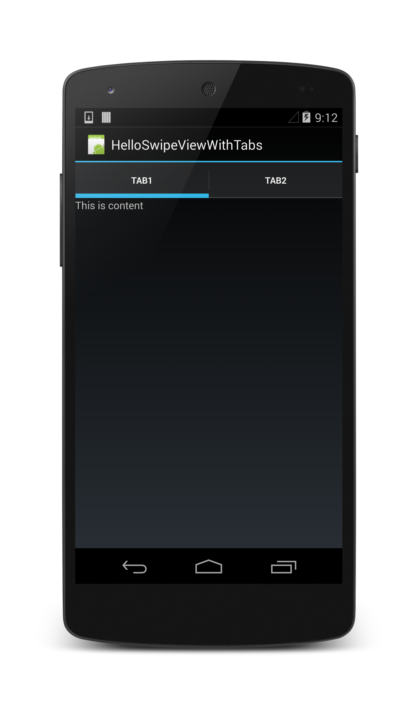

# Xamarin.Android HelloSwipeViewWithTabs

This sample app demonstrates how to use ViewPager and ActionBar
together. ViewPager provides a "swiping view" and ActionBar provides
the tabs.

These two classes provide a very nice user experience together, but do
not provide an intuitive approach to integration. This sample
demonstrates how.

There are two primary integration challenges:

- ActionBar and Viewpager come in different versions of the Android SDK and require special handling to work together.

- Typically, ActionBar 'owns' its tab content. When used with ViewPager, ActionBar must give up content ownership to ViewPager, and just coordinate swipes with (essentially) fake tab transitions.

According to the docs,
[ActionBar](http://developer.android.com/guide/topics/ui/actionbar.html)
first appeared in API level 11 and
[ViewPager](http://developer.android.com/reference/android/support/v4/view/ViewPager.html)
in Support Library v4. The split between mainline and support
libraries ends up being quite important. ActionBar works with
[Android.App.Fragment](http://developer.android.com/reference/android/app/Fragment.html)
and related classes whereas Viewpager works with
[Android.Support.V4.App.Fragment](http://developer.android.com/reference/android/support/v4/app/Fragment.html). The
trick is to change your Activity to derive from
[FragmentActivity](http://developer.android.com/reference/android/support/v4/app/FragmentActivity.html),
which satisfies both the regular and 'Support' API worlds.

The sample provides "shape" classes that satisfy the API requirements
of ViewPager, and then uses lambdas to provide the required
implementation. This approach ends up being quite nice, since the
implementation can be written inline within the Activity without
hiding it within separate classes. That's not a requirement, however.

## License

Apache 2